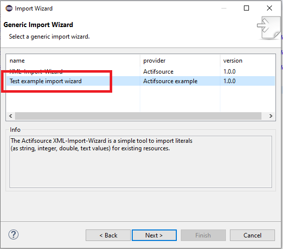

# Generic Import Wizard
In this project we will show how to import a simple xml into the model.


Example to import:

```
The Actifsource XML-Import-Wizard is a simple tool to import literals (as string, integer, double, text values) for existing resources.
SGUID references the subject by its GUID while PGUID references the literal by its GUID. Please note that there can be any prefix in front of SGUID and PGUID.
The Actifsource XML-Import-Wizard understands the following format:

<any-tag any-attr-SGUID='GUID' any-attr-PGUID='GUID'>VALUE1</any-tag>
<any-tag any-attr-SGUID='GUID' any-attr-PGUID='GUID'>VALUE2</any-tag>
<any-tag any-attr-SGUID='GUID' any-attr-PGUID='GUID'>VALUE3</any-tag>

The GUID has to be provided in the 8-4-4-4-12 format: XXXXXXXX-XXXX-XXXX-XXXX-XXXXXXXXXXXX
Please note that the following input means the same as above when the subject cardinality is greater than 1 for any literal type except text.
<any-tag any-attr-SGUID='GUID' any-attr-PGUID='GUID'>VALUE1
 VALUE2
VALUE3</any-tag>
For text values newline means new line in the text.
```

## Wizard





## Requirements
Actifsource Workbench Enterprise Edition

## License
[http://www.actifsource.com/company/license](http://www.actifsource.com/company/license)
